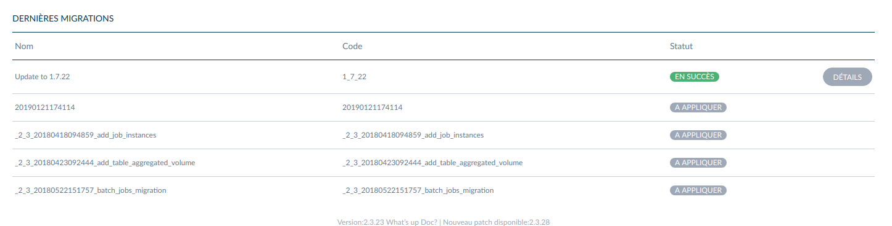

# Akeneo Migrations Manager Bundle - C&M

> This bundle allows to manage migrations on dashboard on your Akeneo project.

This bundle provides a widget to list available migrations and a custom job to follow migrations execution.

Made with :blue_heart: by C&M

## Requirements

|                                     | Version |
| ----------------------------------- | ------- |
| PHP                                 | `>=7.1` |
| [Akeneo](https://www.akeneo.com/)   | `>=2.3` |

## Installation

### Download the Bundle

```console
$ composer require clickandmortar/akeneo-migrations-manager-bundle
```

### Enable the Bundle

Enable the bundle by adding it to the list of registered bundles
in the `app/AppKernel.php` file of your project:

```php
<?php
// app/AppKernel.php

// ...
class AppKernel extends Kernel
{
    public function registerBundles()
    {
        $bundles = [
            // ...
            new ClickAndMortar\AkeneoMigrationsManagerBundle\ClickAndMortarAkeneoMigrationsManagerBundle(),
        ];

        // ...
    }

    // ...
}
```

## Configuration

### Create custom job to manage migrations

```
php bin/console akeneo:batch:create-job internal execute_migration migration execute_migration_by_version '{"migrationVersion":null}' 'Execute migration by version'
```

## Usage

### Create migration

Create a new migration with the classic command:

```
php bin/console doctrine:migrations:generate
```

Extends `AbstractStepMigration` to use steps methods. Example:

```
<?php

namespace Pim\Upgrade\Schema;

use ClickAndMortar\AkeneoMigrationsManagerBundle\Migration\AbstractStepMigration;
use Doctrine\DBAL\Schema\Schema;

/**
 * Class Version20190121174114
 *
 * @author  Simon CARRE <simon.carre@clickandmortar.fr>
 * @package Pim\Upgrade\Schema
 */
class Version20190121174114 extends AbstractStepMigration
{
    /**
     * Migration label
     *
     * @var string
     */
    const MIGRATION_LABEL = 'Update to 1.0.1';

    /**
     * @param Schema $schema
     */
    public function up(Schema $schema)
    {
        $this->createNewStep('Start a new step');
        
        // Process here
        
        $this->addWarning('Error: Bad process');
        $this->createNewStep('Start the last step');
        
        // Process here
    }

    /**
     * Get migration label used in dashboard widget
     *
     * @return string
     */
    public static function getLabel()
    {
        return self::MIGRATION_LABEL;
    }
}

```

## Start migration

You can start migration with custom created job to enable tracking in widget view:

```
php bin/console akeneo:batch:job -c '{"migrationVersion":"<my_version>"}' execute_migration_by_version
```


